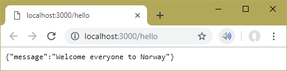
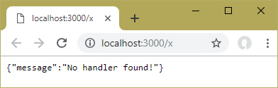

# NodeHomework
## Homework Assignments in Node.js Master Class, Pirple
### Homework Assignment #1  Building a RESTful API
#### Description 
A RESTful JSON API that listens on a port of your choice and when someone post anything to the route/hello, you return a welcome mesage in JSON format. 
#### Testing
 Start server in terminal: **node index.js**  
   ##### Test1: 
   http://localhost:3000/hello   
                        #####
   ###### Test2: 
   http://localhost:3000/x        
 
